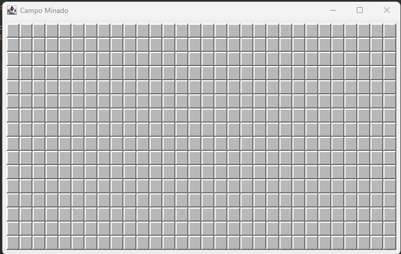

 

<h3 align="center">Campo Minado</h3>

  

   Um projeto feito em Java de um jogo do campo minado
     
   
     
    

  
  

<!-- ABOUT THE PROJECT -->
## Sobre o Projeto
 

  O projeto é um jogo chamando campo minado, deito em java para bota meus conhecimentos adquiridos em prática, ele é constituído em 3 pacotes, o Modelo, onde a lógica do campo do jogo é feita, exceção onde as execeptions são feitas, e a visão onde o jogo fica mais gráfico, e por fim o método main, onde o jogo de fato funciona.

 
<b>Tecnologias e conceitos utilizados</b>
<ol>
  <li>JUnit 5</li>
  <li>Stream Api</li>
  <li>funçoes lambda</li>
  <li>collections</li>
  <li>Tratamentos de Erros</li>
  <li>programação orientada a objetos</li>
  <li>Programação funcional</li>
</ol>

